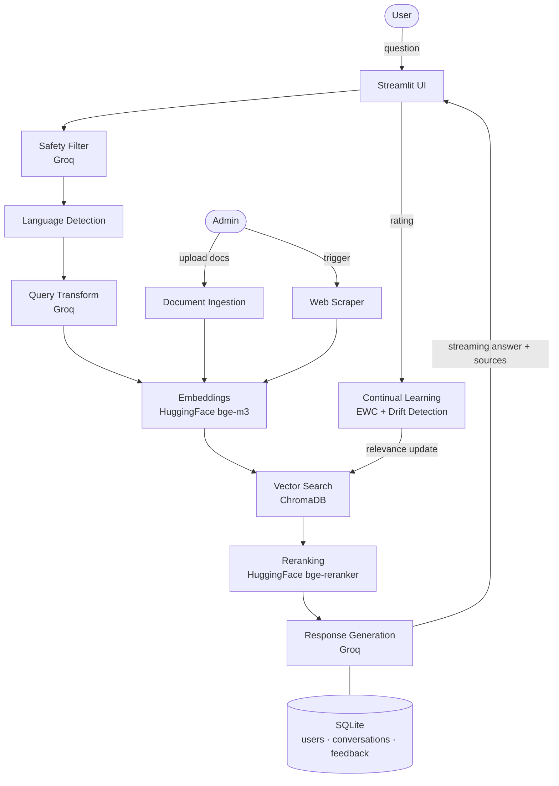

# AdaptIQ

**AdaptIQ** is a smart assistant that knows everything your company knows. Upload your documents, point it at your website, and from that moment on anyone on your team can ask questions in natural language and get real answers — explained in plain language, with references to exactly where the information came from.

Screens every query for safety. Respects who can see what. Gets smarter the more it's used.

---

## Try it Live

**[adaptiq-2soundright.streamlit.app](https://adaptiq-2soundright.streamlit.app)**

| Role | Email | Password |
|------|-------|----------|
| Admin | admin | admin |
| User | user | user |

**As a User**, ask questions in the chat and get AI-generated answers with source citations.

**As an Admin**, everything above, plus upload documents, run the web scraper, view analytics, and review audit logs.

---

## Documentation

| Section | Description |
|---------|-------------|
| [Personas](novus-memory/personas/personas.md) | The three user roles, Admin, Worker, and User, and what each can do |
| [Product Areas](novus-memory/product_areas/product_areas.md) | The six functional areas of AdaptIQ: Auth, Chat, Documents, Analytics, Audit Logs, Web Scraper |
| [Key Flows](novus-memory/key_flows/key_flows.md) | Step-by-step walkthroughs of every major user flow |
| [Integrations](novus-memory/integrations/integrations.md) | External services connected to AdaptIQ: Groq, HuggingFace, ChromaDB |
| [Technical Docs](novus-memory/documentation/documentation.md) | RAG pipeline, continual learning, multilingual support, security, access control, data model |
| [Site Map](novus-memory/site_map.md) | Visual diagram of the full application structure |

---

## Built With

| Tool | What it does |
|------|-------------|
| Streamlit | Interface, clean, fast, works on any device |
| Groq | Powers AI responses and safety filtering |
| HuggingFace | Embeddings (BAAI/bge-m3) and reranking (BAAI/bge-reranker-large) |
| ChromaDB | Vector database for semantic document search |
| SQLite | Users, documents, conversations, feedback |

