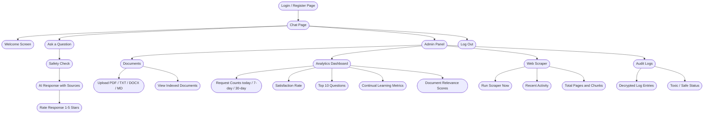

# Site Map

```mermaid
flowchart TD
    A([Login / Register Page]) --> B([Chat Page])
    B --> C([Welcome Screen])
    B --> D([Ask a Question])
    D --> E([Safety Check])
    E --> F([AI Response with Sources])
    F --> G([Rate Response 1-5 Stars])
    B --> H([Admin Panel])
    H --> I([Documents])
    I --> I1([Upload PDF / TXT / DOCX / MD])
    I --> I2([View Indexed Documents])
    H --> J([Analytics Dashboard])
    J --> J1([Request Counts today / 7-day / 30-day])
    J --> J2([Satisfaction Rate])
    J --> J3([Top 10 Questions])
    J --> J4([Continual Learning Metrics])
    J --> J5([Document Relevance Scores])
    H --> K([Web Scraper])
    K --> K1([Run Scraper Now])
    K --> K2([Recent Activity])
    K --> K3([Total Pages and Chunks])
    H --> L([Audit Logs])
    L --> L1([Decrypted Log Entries])
    L --> L2([Toxic / Safe Status])
    B --> M([Log Out])
```
